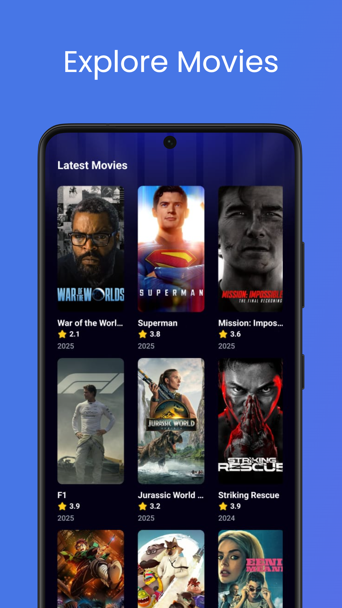
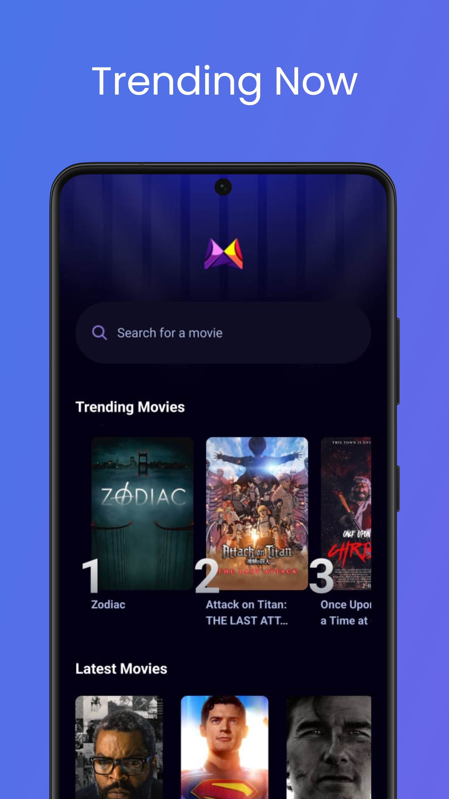
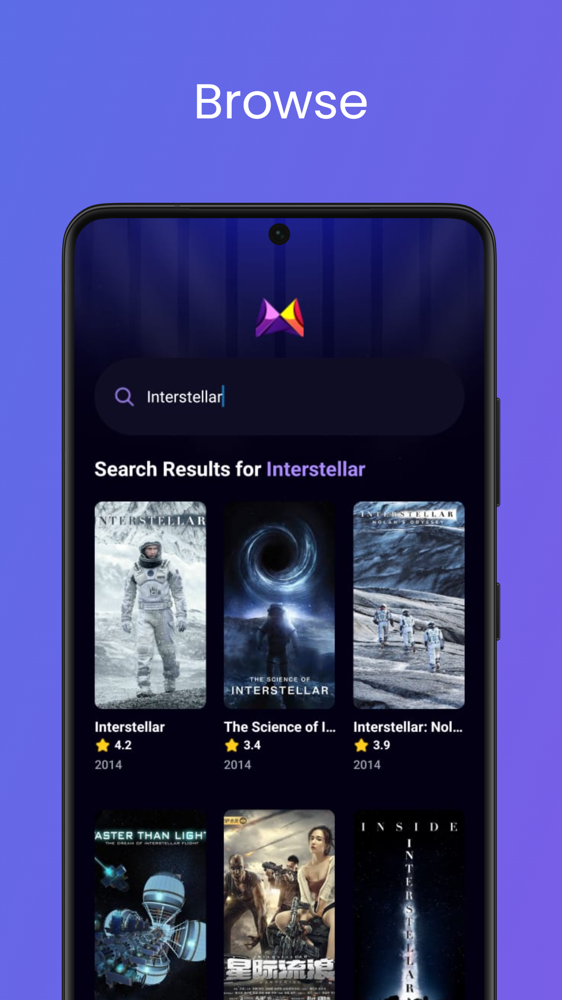
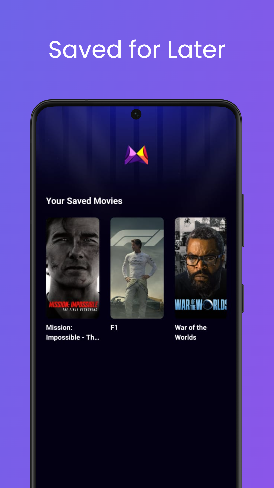
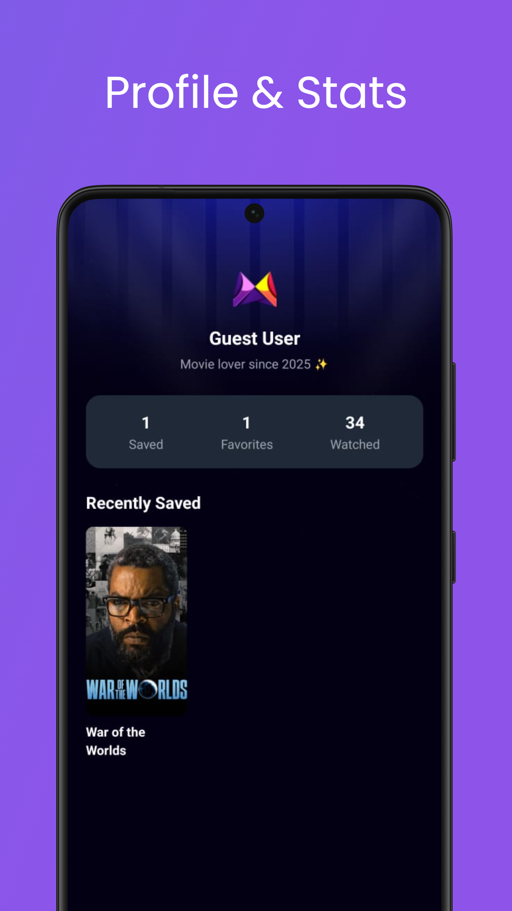

# 🎬 MovieFlix

A mobile app built with **React Native** and **Appwrite** that lets users browse movies, search by title, and save their favorites to a personal watchlist.  

---

## ✨ Features

- 📽️ Browse trending and popular movies  
- 🔎 Search movies by title 
- 💾 Save favorites to your watchlist  
- 👤 Guest User profile  
- ⚡ Powered by **Appwrite** backend  

---

## 📱 Screenshots

> _Preview of the app UI_

1. **Home Screen**  
     

2. **Trending Home Screen**  
     

3. **Search Movies**  
     

4. **Movie Details Screen**  
     

4. **Saved**  
     

5. **Profile**  
     

---

## 🛠️ Tech Stack

- [React Native](https://reactnative.dev/) — cross-platform mobile framework  
- [Expo](https://expo.dev/) — development & build tools  
- [Appwrite](https://appwrite.io/) — authentication, database & storage  
- [TMDb API](https://www.themoviedb.org/) — movie data (if used)  

---

## 🚀 Getting Started

1. Clone the repo

   ```bash
   git clone https://github.com/Chouaib-Djerdi/ReactNative_Movie_App
   cd movieapp
   ```

2. Install dependencies

   ```bash
   npm install
   ```

3. Start the app

   ```bash
   npx expo start
   ```